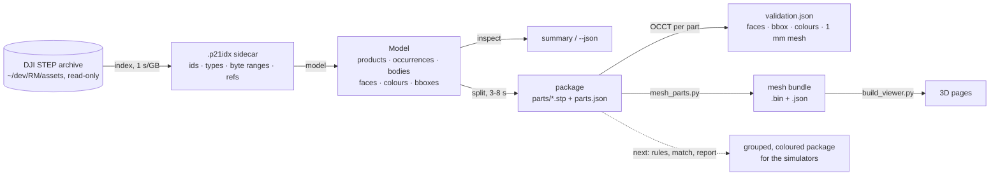

# rm-map-tools

Tooling that turns the DJI RoboMaster (RMUC) field STEP releases into a
losslessly split, per-part package that CAD kernels load in seconds instead
of hours, plus the validation and preview pipeline that proves it.

| Document | What it covers |
|---|---|
| [`docs/architecture.md`](docs/architecture.md) | Crates, modules, data structures, the split algorithm, performance |
| [`docs/step-notes.md`](docs/step-notes.md) | What the DJI STEP files actually contain: exporters, ownership chain, colours, transforms, traps |
| [`docs/previews.md`](docs/previews.md) | The OCCT mesh bundle and the 3D / plan-view pages built from it |
| [`docs/split-proof.md`](docs/split-proof.md) | The measured proof that the split is lossless, with every number |
| [`HANDOFF.md`](HANDOFF.md) | Background, decisions, target package layout, open questions |

## Pipeline



Everything left of the package is Rust and needs no CAD kernel. Everything
right of it runs OCCT on one part at a time, which is why it fits in a few GB
of RAM instead of the ~40 GB a whole-file import takes.

## Crates

| Crate | What |
|---|---|
| `crates/step21` | Library: streaming STEP Part 21 scanner (`scan`), columnar entity index with binary sidecar (`index`), product / assembly / body / style model (`model`), lossless per-product split (`split`), string and number helpers (`decode`). No typed entity graph; everything works on byte ranges. |
| `crates/rm-map-tools` | CLI: `index`, `inspect`, `split`. |

## Use

```sh
cargo build --release
B=target/release/rm-map-tools

# one streaming pass; writes <file>.p21idx next to the file
# (use -o to put it elsewhere: the archive directory must stay untouched)
$B index ~/dev/RM/assets/rm2026-cad/UTF-8__RMUC2026_V2.0.0.stp -o /tmp/v20.p21idx

# products, tree, bodies, faces, colours; numbers match HANDOFF §2
$B inspect /tmp/v20.p21idx            # or the .stp directly (indexes in memory)
$B inspect /tmp/v20.p21idx --json v20.json   # full dump

# one standalone STEP per product + parts.json manifest
$B split /tmp/v20.p21idx -o /tmp/pkg_v20
$B split /tmp/v20.p21idx -o /tmp/pkg_one --products 59853   # a single product id
```

`inspect` and `split` accept either the sidecar or the STEP file. A sidecar is
reused only if its recorded source path and size still match.

## Status

| Step | State |
|---|---|
| Archive V1.2.0 and the rune file with checksums | done |
| Lossless per-product split, Python proof | done, `docs/split-proof.md` |
| OCCT validation of every part, per-part meshes vs the 9 h whole-file glb | done |
| Rust `index`, `inspect`, `split` | done, byte-identical to the validated Python output |
| 3D previews of V2.0.0 and V1.2.0 from the split parts | done, `docs/previews.md` |
| Per-body split for the flat V2.0.0 equipment products | not started |
| `assembly.stp`, package layout, `rules/`, `match`, `report` | not started, see `HANDOFF.md` §4–§6 |

## Repository layout

```
crates/step21/            library crate (scan, index, decode, model, split)
crates/rm-map-tools/      CLI
prototype/                Python originals and OCCT validators (see docs/architecture.md)
prototype/preview/        mesh bundle -> 3D page builder and template
docs/                     architecture, STEP notes, previews, proof report
out/{v20,v12,rmul}/       manifests and validation reports of the last runs
```

The Python scripts in `prototype/` need the `cadquery-ocp` venv described in
`docs/previews.md`; the Rust crates need only a stable toolchain (Rust 1.88
or newer, edition 2024). Part files, sidecars and mesh bundles are
regenerable and are not stored in the repository; `out/v12/parts.json` is
kept gzipped because it describes 79,247 bodies.

## Source data, ownership and licence

The field models this tool processes are the official RoboMaster
University Championship / League arena CAD releases by **DJI / RoboMaster**
(https://www.robomaster.com). They are DJI's intellectual property,
released to competition teams under DJI's terms, and **no CAD file or mesh
derived from them is committed to this repository**; `out/` holds only
derived metadata for checking the proof. See [`NOTICE.md`](NOTICE.md) for
the full statement and the third-party software list. This project is not
affiliated with or endorsed by DJI or RoboMaster.

The code and documentation are dual-licensed under the MIT License
(`LICENSE-MIT`) or the Apache License 2.0 (`LICENSE-APACHE`), at your
option. CI (`.github/workflows/ci.yml`) runs fmt, clippy, tests, rustdoc
and a smoke test on Linux and macOS; tagging `v*` builds release binaries
for Linux and macOS (`release.yml`).
