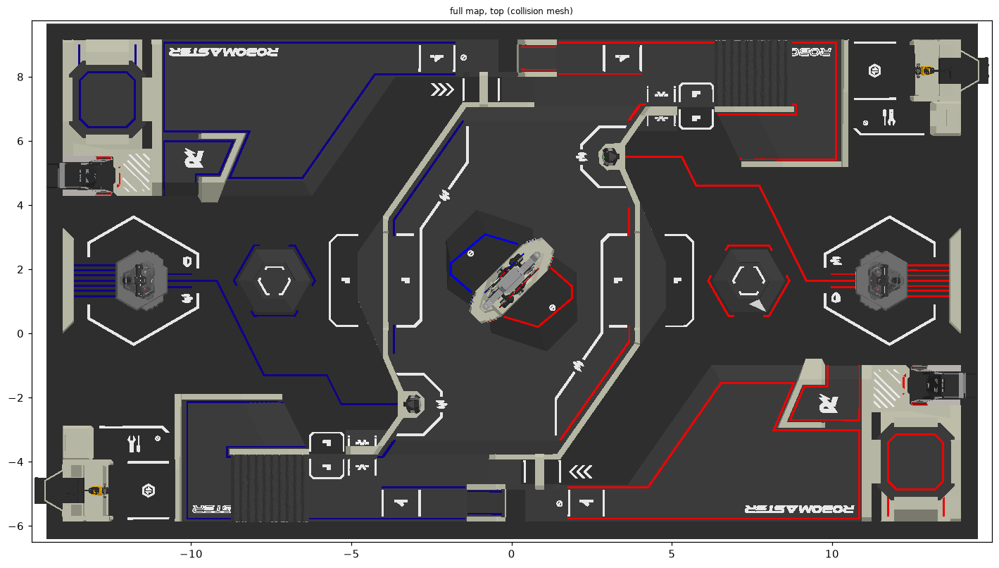

# rm-map-tools

[English](README.md) · [简体中文](README.zh-CN.md)

将 RoboMaster 场地 CAD 拆分为独立 STEP 零件，并导出供查看器和仿真器使用的场地资源。



工具先拆分 STEP 引用关系，再按零件调用 CAD 内核，无需先导入整个场地。一次 M3 Pro 实测将 1.25 GB 的 RMUC V2.0.0 文件在 8.4 秒内拆成 429 个零件。索引、网格化、内存占用及对比范围见[性能记录](docs/performance.md)。

## 可以做什么

- 查看和拆分官方 STEP 文件，保留源几何实体。
- 生成包含独立可视网格、碰撞网格、位置、颜色和语义信息的 GLB 资源包。
- 通过网格化设置、带误差检查的减面和纹理图案降低模型体积。
- 将静态场景导出为 SDF、MJCF、USD，将关节设备导出为 SDF、URDF、USD。
- 在[交互查看器](docs/viewer.md)中旋转模型并调节关节。

## 快速开始

克隆仓库后，在仓库根目录运行。需要 Rust 1.88+，下载脚本需要 Python 3；索引和拆分无需 CAD 内核。

```sh
cargo build --release --locked
python3 source/download.py fetch RMUC2026_V2.0.0.stp
mkdir -p out

target/release/rm-map-tools index source/RMUC2026_V2.0.0.stp -o out/v20.p21idx
target/release/rm-map-tools inspect out/v20.p21idx --json out/v20-inspection.json
target/release/rm-map-tools split out/v20.p21idx -o out/v20
```

下载脚本支持断点续传和校验。拆分结果位于 `out/v20/parts/`，清单为 `parts.json`。源 CAD 和生成的模型包不包含在 Git 仓库中。

## 文档

主指南提供中文版，深度技术参考以英文为主。

| 指南 | 内容 |
| --- | --- |
| [入门](docs/getting-started.md) | 安装、下载、拆分与校验 |
| [导出](docs/exporting.md) | 支持格式、输入要求与命令 |
| [简化](docs/simplification.md) | 各优化步骤、执行顺序、设置与检查 |
| [架构](docs/architecture.md) | STEP 处理、资源生成及代码结构 |
| [全部文档](docs/README.md) | 技术参考、几何审计、测试记录与交互查看器 |

文档也可构建为带交互模型控件和中英文切换的 VitePress 网站。运行 `npm ci` 和 `npm run docs:dev`，或查看[网站设置与 GitHub Pages 部署](docs/site.md)。

## 许可与源数据

代码和文档采用 [MIT](LICENSE-MIT) 或 [Apache-2.0](LICENSE-APACHE) 双重许可。官方 CAD 及派生模型几何属于 DJI / RoboMaster，使用时仍受其条款约束。本项目为独立项目，详见 [NOTICE.md](NOTICE.md)。
