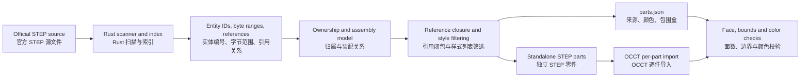
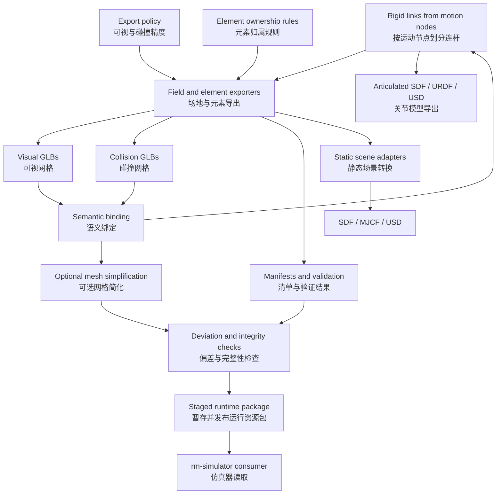
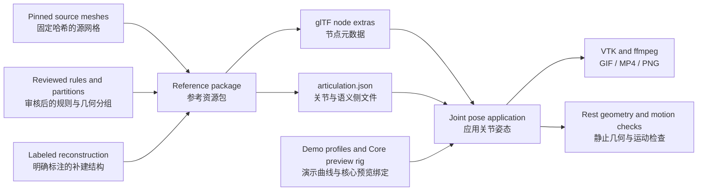

# Architecture diagrams / 架构图

[English README](../README.md) · [中文 README](../README.zh-CN.md) · [Implementation details / 实现细节](architecture.md)

These diagrams separate source preservation, asset generation, and demo behavior. A successful check in one stage does not certify the others.

以下分别展示源数据保留、资源生成和演示行为。一个阶段通过检查，并不代表其他阶段也已得到验证。

## 1. STEP processing / STEP 处理

`crates/step21` handles source bytes and references; `crates/rm-map-tools` exposes `index`, `inspect`, and `split`. Geometry entities are copied verbatim. Shared list records are filtered, while assembly placements are recorded separately. OCCT is only needed after the split.

`crates/step21` 处理源字节与引用，`crates/rm-map-tools` 提供 `index`、`inspect` 和 `split` 命令。几何实体逐字节复制，共享列表按归属筛选，装配位置单独记录。只有拆分之后才需要 OCCT。

## 2. Simulator asset pipeline / 仿真资源流水线

Visual and collision tolerances are independent. Semantic bindings precede simplification so node, material, and joint boundaries can be preserved. The simplifier has its own collision contract and sampled deviation checks. File hashes verify package integrity. SDF/MJCF/USD adapters export static scene arrangements; articulated assets require an explicit rest-pose bake in that path.

可视与碰撞精度独立设置。先做语义绑定，再简化网格，以保留节点、材质和关节边界。简化器有独立的碰撞约定与采样偏差检查，文件哈希用于检查资源包完整性。SDF/MJCF/USD 路径导出静态场景，遇到带关节的资源时需明确选择静止姿态烘焙。

The separate [articulated exporter](articulated-formats.md) preserves semantic joint bindings as SDF, URDF, and USD kinematic equipment models.

独立的[关节导出器](articulated-formats.md)将语义关节绑定保留为 SDF、URDF、USD 运动学设备模型。

## 3. Semantic reference and motion / 语义参考与运动

The reference package is separate from the active simulator installation. Joint metadata describes axes, parents, children, limits where known, and evidence. Armor and LED metadata describe family, size, color ownership, and control channels. Layers categorize geometry; they do not automatically remove collision geometry.

参考资源包与仿真器当前安装分开。关节元数据记录轴、父子关系、已知限位和依据。装甲板与 LED 元数据记录类型、大小、队伍颜色归属及控制通道。图层用于分类，不会自动删除碰撞几何。

The Base inner wall is a labeled reconstruction. Its shield travel is illustrative. The Core's source reference retains unbound meshes and six joint frames; a disposable demo rig binds selected CAD parts, restores the tool enclosure, and adds schematic bearings. The rail's sine motion is demo-only. Simulator match behavior remains a separate consumer responsibility.

基地内壁是明确标注的补建结构，护甲行程为示意值。科技核心源参考保留未绑定网格和六个关节框架；临时演示模型绑定选定 CAD 零件、恢复工具外壳，并使用示意轴承。轨道正弦运动只用于演示。比赛状态与控制逻辑仍由使用资源的仿真器负责。
