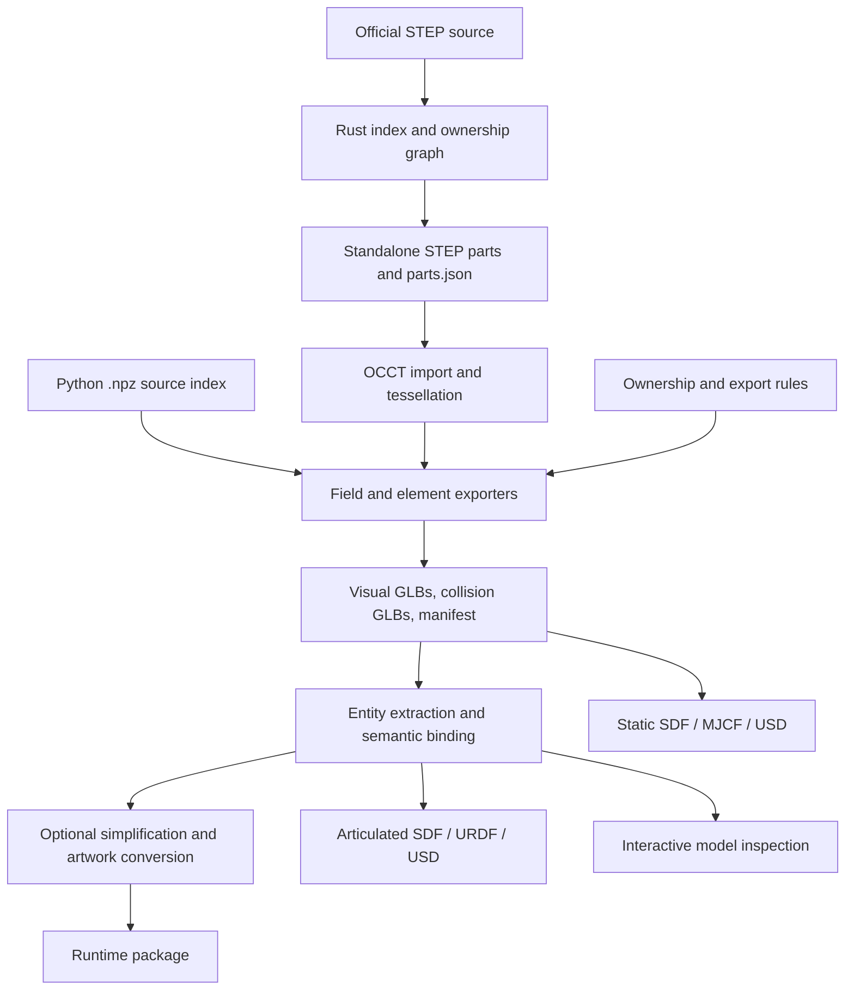

# Architecture

[Documentation](README.md) · [Exporting](exporting.md) · [Simplification](simplification.md) · [简体中文](zh/architecture.md)

`rm-map-tools` separates source splitting, CAD meshing, and package processing. Rust handles STEP bytes and references. Python uses OCCT to import split parts and produces the assets consumed by viewers and simulators.

## Pipeline

These branches are separate workflows. A format adapter does not run every optimization automatically. See [Exporting](exporting.md) for inputs and [Simplification](simplification.md) for ordering constraints.

## Source processing

The Rust scanner records each STEP entity's ID, type, byte range, and outgoing references. The ownership model identifies products, bodies, assembly occurrences, and styles. The splitter follows each product's references and copies the selected geometry entities verbatim, filtering shared presentation lists to the selected members.

This stage needs no CAD kernel. OCCT imports the resulting parts to check faces, bounds, and colors and to approximate surfaces with triangles. Source preservation and mesh accuracy are separate checks. The [split proof](split-proof.md) records preservation evidence; [STEP internals](step-internals.md) documents the index format, Rust modules, and closure algorithm.

The Rust `.p21idx` sidecar and Python `.npz` source index are different formats. The CLI uses the former; Python geometry exporters use the latter alongside `parts.json` and the split STEP files.

## Asset generation

Field and element exporters apply placement and ownership rules, tessellate visual and collision geometry independently, and write GLBs with manifests and validation reports. Export policies control tolerances and explicit collision exclusions. Copied equipment retains its existing geometry and metadata.

Entity extraction creates separately named assets. Semantic binding adds joint hierarchy, armor, LED, team-color, and layer metadata to GLB node extras and `articulation.json`. Rules can select source triangles, so binding must precede simplification. Texture patches are attached after backing simplification.

Manifests record file hashes and collision methods. Consumers use these declarations to choose and validate collider files. Hash checking detects changed files; it does not establish geometric accuracy. See [export presets](export-presets.md), [semantic export](semantic-export.md), and [mesh simplification](mesh-simplification.md) for the contracts.

## Motion and consumers

The semantic reference package is separate from the active simulator installation. Articulated exporters use its existing motion-node hierarchy to create rigid links and joints. Static adapters bake articulated inputs at rest when explicitly requested.

The documentation viewer renders local models with Three.js and exposes joint coordinates as sliders. The Technology Core keeps six joint frames in the reference; its animated mesh uses a separate preview rig. Match controllers belong to the consuming simulator. See [reference assets](reference-assets.md) and [articulated formats](articulated-formats.md).

## Code map

| Location | Responsibility |
| --- | --- |
| `crates/step21/` | Scanner, index, ownership model, and STEP splitter |
| `crates/rm-map-tools/` | `index`, `inspect`, and `split` CLI |
| `python/export_*.py` | Geometry, semantic, and simulator exporters |
| `python/export_job.py` | JSON job validation and ordered stage execution |
| `python/simplify_package.py` | Mesh reduction and deviation checks |
| `python/texture_atlas.py` | Artwork extraction, backing simplification, and texture export |
| `python/preview/` | Source HTML viewer and reusable motion/rig helpers |
| `docs/.vitepress/` | Documentation theme and interactive model viewer |
| `rules/` | Export settings and reviewed source selections |
| `source/` | Download helper and source/reference records |
| `benchmarks/` | Dated measurements and reproduction scripts |

[Performance](performance.md) collects timing and memory measurements. [Geometry audit](geometry-audit.md) records source omissions and corrections.
