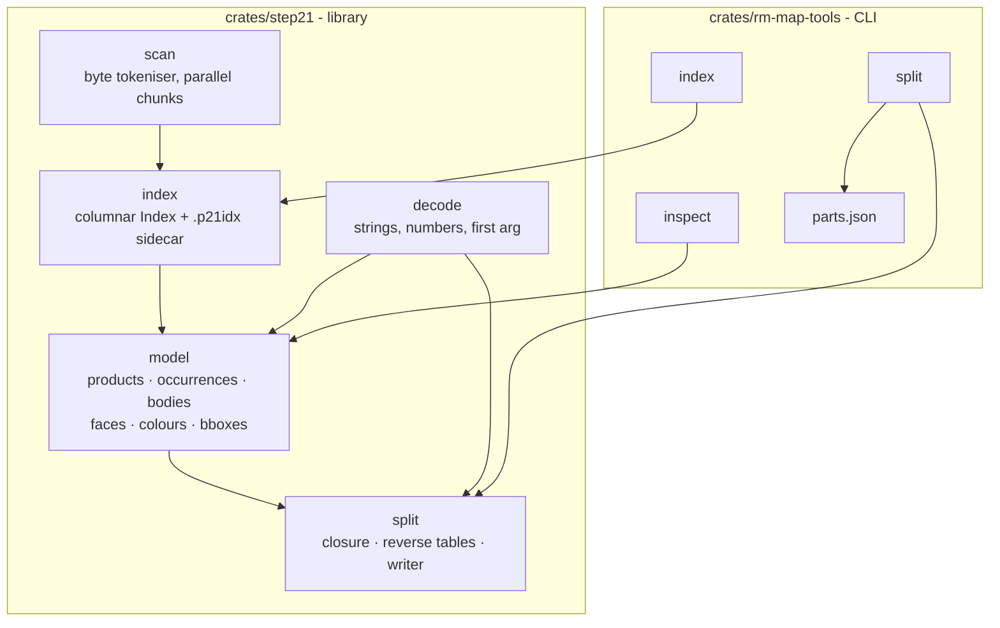
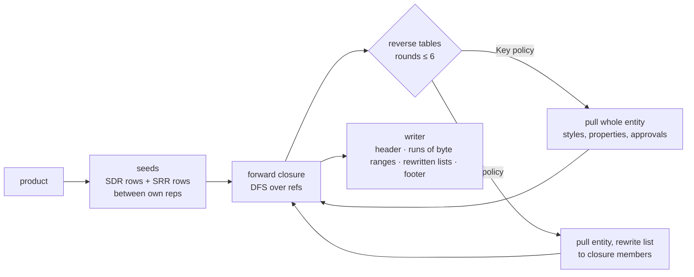

# Architecture

How `rm-map-tools` turns a gigabyte STEP file into per-part files without a
CAD kernel, and how the pieces fit. Numbers are from the runs recorded in
`split-proof.md` (Apple M3 Pro, 11 cores, 18 GiB).

## 1. Principle

The DJI files are too large for a kernel import (9 hours, ~40 GB for
V2.0.0) but they are plain text: `#id=TYPE(args);` instances that only
reference each other by `#id`. So the tool never parses the entities into
typed structures. It records, for every instance, its id, type, byte range
and outgoing references, and does all reasoning on that graph. A part file
is then the byte-for-byte copy of a subset of instances, with a handful of
list-carrying entities re-emitted with a filtered list. Losslessness holds
by construction and is checked (`coverage.py`: every geometry entity of the
source lands in exactly one part, verbatim).

## 2. Crates and modules



| Module | Responsibility | Key items |
|---|---|---|
| `scan` | Find every instance in the DATA section of a memory-mapped file. Chunks are cut at `\n#id=` boundaries and scanned in parallel. Strings (`''` escape), `/* */` comments and `#refs` are tokenised; a complex instance `#id=(A(..)B(..));` gets the pseudo type `CPLX`. | `scan_chunk`, `chunk_bounds`, `data_section_start`, `Scanned`, `Chunk` |
| `index` | Merge the chunks into columnar arrays, remap type names to one table, build the id→row map. Save/load the sidecar. | `Index::build/save/load`, `row(id)`, `refs_of`, `text`, `args`, `rows_of`, `type_histogram` |
| `decode` | The only argument parsing that exists: string literals with `\X2\…\X0\` and `\X\HH` escapes, runs of numbers, the first (enumeration) argument. | `decode_string`, `first_string`, `numbers`, `first_arg` |
| `model` | AP203/AP214 semantics as exported by Creo and ST-Developer: which representation belongs to which product, assembly occurrences, bodies, face traversal with shell tracking, effective colours, vertex bounding boxes. Mirrors `prototype/p21model.py`. | `Model::new`, `body_faces_shells`, `face_colour_hist`, `body_bbox`, `surface_colour`, `body_product` |
| `split` | Per-product closure and file writer. | `Splitter::new`, `closure`, `write_part`, `REVERSE`, `part_filename` |

The CLI adds the manifest schema (`parts.json`), the `inspect` summary and
tree printer, sidecar discovery and RSS reporting.

The workspace denies `unsafe_code` except for the single memory-map call in
`index::map_file`, which carries a SAFETY comment; clippy runs with
`undocumented_unsafe_blocks = deny`.

## 3. Data structures

### Index (in memory)

Rows are positions in the arrays; `Row = u32`. All entity data is columnar:

| Array | Type | Meaning |
|---|---|---|
| `ids` | `u32` | entity id, file order (not sorted in V2.0.0) |
| `types` | `u16` | index into `type_names` |
| `starts` | `u64` | byte offset of `#` |
| `lens` | `u32` | bytes up to and including `;` |
| `ref_start` | `u64`, n+1 | CSR offsets into `refs` |
| `refs` | `u32` | referenced entity ids, in argument order |
| `row` | `i32`, max_id+1 | id → row, `-1` if absent |

V2.0.0: 7.0 M entities, 96 M references (88 M of them inside 3,848
`PRESENTATION_LAYER_ASSIGNMENT` lists). V1.2.0: 13.3 M entities, ids up to
13,268,383.

### Sidecar `.p21idx`

```
magic  "P21IDX\0\x01"
u64 ×6 source size, DATA offset, n entities, n refs, n types, source path length
bytes  source path (UTF-8)
types  n_types × (u16 length + name bytes)
arrays ids, types, starts, lens, ref_start, refs   (little-endian, raw)
```

`open_index` accepts the sidecar only if the recorded source path and size
match the file on disk; otherwise it indexes in memory. Sizes: 542 MB for
V2.0.0, 386 MB for V1.2.0.

### Model

Built once from the index, all in rows:

- `products`, `product_name`, the ownership chain `pdf_product`,
  `pd_product`, `pds_pd`, `rep_product` (representation → product),
  `sdr_of_rep`, `product_reps`, `srr` (representation relationships).
- `occurrences` (`NEXT_ASSEMBLY_USAGE_OCCURRENCE`: parent, child), `children`
  (parent → children with occurrence row), `roots`.
- `bodies` (body row, representation row), `body_rep`.
- `colours` (canonical key `r,g,b` with 4 decimals, RGB, names),
  `styled` (target, surface colour, curve colour, overriding flag),
  `styles_of_target`.

Traversals that need "visited" marks use a thread-local stamp array
(`with_marks`) so the model stays `Sync` for rayon.

### Manifest `parts.json`

Written by `split`; the schema is shared with the Python prototype so the
two outputs can be diffed field by field.

```
source, source_size, entities, split_seconds, total_entities_written, total_bytes_written
colour_names: { "r,g,b": [names given in the file] }
parts[]: file, product_id, name, entities, rewritten, bytes, seconds,
         bodies[]: id, type, faces, extra_outer_bounds, body_colour,
                   face_colours { "r,g,b": count }, bbox_min, bbox_max, vertices
```

`body_colour` is the body-level style; the effective colour of a face is
face > shell > body, so consumers must use `face_colours` (see
`step-notes.md` §4).

## 4. The split



1. **Seeds.** The product's `SHAPE_DEFINITION_REPRESENTATION`s and the
   `SHAPE_REPRESENTATION_RELATIONSHIP`s that link two of its own
   representations (sheet bodies live in a second representation).
2. **Forward closure.** Depth-first over `refs` with a per-thread mask.
   Geometry, topology, placements, units and contexts, the product / PDM
   chain all arrive this way.
3. **Reverse tables.** Some entities point *at* the geometry rather than
   being pointed at: styles, material properties, approvals, categories,
   layers, the presentation representation. `REVERSE` lists 15 entity types
   with a policy: `Key(pos)` means "this entity belongs to the closure if
   its argument at `pos` (negative = from the end) is in the closure, pull it
   whole"; `List` means "pull it if any list member is in the closure, and
   rewrite the list to the members that are". Reverse lookups are a CSR
   built by counting (no sort), 2.5 s for V2.0.0 because of the 88 M layer
   references. Pulled entities can reference new entities, so the closure
   re-runs; six rounds bound it in practice. A list is rewritten once, with
   the mask as it was at the round start, exactly like the Python prototype,
   which keeps the outputs byte-identical.
4. **Writer.** Header of the source, CRLF or LF as in the source, then runs
   of contiguous byte ranges copied straight from the mmap, rewritten lists
   emitted wrapped at 72 columns, then `ENDSEC;` / `END-ISO-10303-21;`.
   Part file name is the sanitised product name plus the product entity id,
   e.g. `BREP_9-59853.stp`.

Products are split in parallel with rayon; each worker owns a `Scratch`
(mask + touched list) so masks are cleared in O(touched).

### Traps that shaped the code

- When re-closing a rewritten entity, skip its own `#id=` prefix or the
  closure re-expands through the original unfiltered list and pulls the
  whole file.
- `ADVANCED_FACE`: drop only the last reference (the surface) when
  traversing topology; dropping two loses the outer bound of single-bound
  faces.
- Reverse lookups must be per-owner slices of a flat array; scanning the
  flat array per hit made the first product take minutes.
- `OVER_RIDING_STYLED_ITEM`'s target is the second-to-last reference.
- V2.0.0 layer lists hold 91 % of all references; anything that touches
  them per product must be O(members in closure), not O(list).

## 5. Performance

| Step | V2.0.0 (1.25 GB) | V1.2.0 (993 MB) |
|---|---|---|
| `index` | 1.3 s | 1.1 s |
| `inspect` from sidecar | 0.5 s | 0.7 s |
| `split`, all products | 8.4 s (2.5 s reverse tables), 429 files | 2.7 s, 1,047 files |
| peak RSS for `split` | 3.6 GB | 1.9 GB |
| Python prototype `split` | 214 s / 5.3 GB | 33 s / 2.4 GB |
| OCCT re-read of every part (validation, 1 mm mesh) | 257 s wall, 4.7 GB peak | 117 s |
| whole-file OCCT import (reference) | 9 h, ~40 GB | not attempted |

The 674 MB `26062900` product dominates every OCCT figure (130–150 s,
4.5 GB on its own); a per-body split of the flat V2.0.0 equipment products
is the planned fix.

## 6. Verification

- Unit tests: scanner fixture with a complex instance, comment and string
  containing a `#`; decode escapes; split list matching.
- `inspect` reproduces the counts in `HANDOFF.md` §2 on all three files.
- `split` output is byte-identical to the Python prototype's, which was
  validated with OCCT (face counts, bounding boxes, effective face colours)
  and against the 9 h whole-file glb (per-part triangle counts, median
  ratio 1.000). Details and residuals in `split-proof.md`.
- `coverage.py` proves that every geometry entity of the source is in
  exactly one part, verbatim.

## 7. What is not here yet

Per-body split, the structure-only `assembly.stp`, the grouped package
layout with `rules/groups.toml` and `rules/palette.toml`, `match`
(fingerprint matching between releases so V1.2.0 colours can be transplanted
onto V2.0.0 geometry) and `report`. `HANDOFF.md` §4–§6 and §10 hold the
design and open questions.
