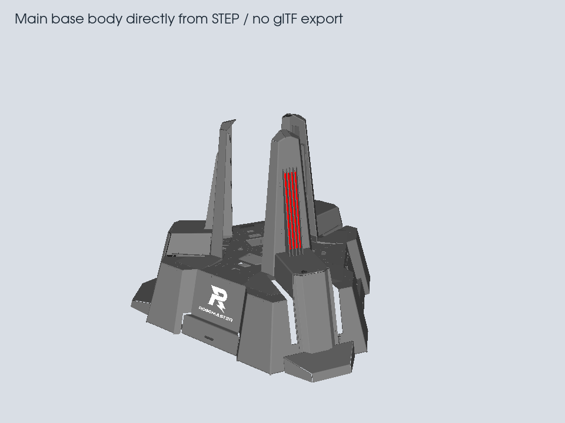
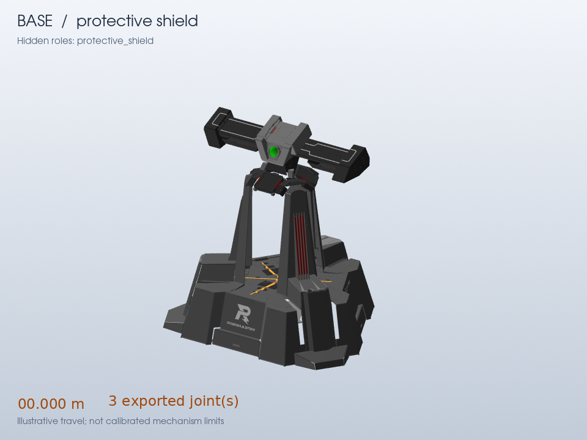
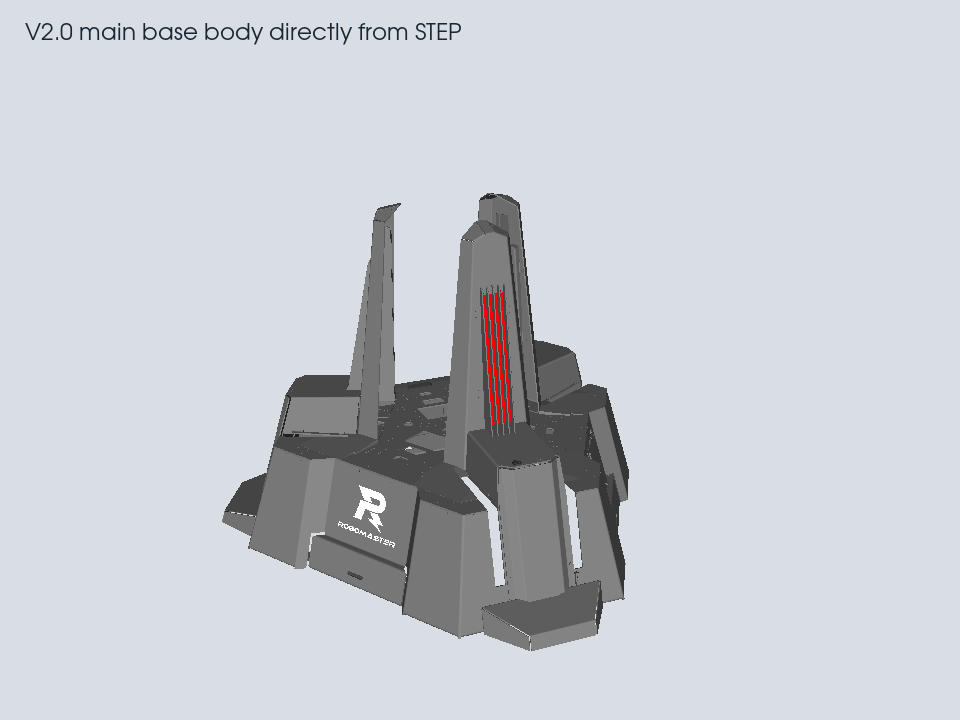

# Base interior audit

The hollow interior is already present in the source CAD. It is not hidden by
the renderer or removed by the semantic exporter. A fresh tessellation of the
main body directly from STEP reproduces the same open structure.



The [source audit](previews/base-source-audit.json) imports all 67 products. No
product has fewer imported faces than its source record: 49,312 recorded faces
and 49,318 imported faces in total. The main body has exactly 5,219 source and
imported faces. Fresh tessellation at 0.5 mm / 0.2 rad produces 316,540 triangles
with no retries or unmeshed faces. This diagnostic bypasses the glTF writer,
semantic grouping and animation.

The rulebook's Figure 4-12 shows the complete open assembly, and section 4.2.2
describes six Base Armor Modules. That drawing uses a different viewpoint;
the empty space between supports alone does not establish which individual
armor panel, if any, is missing. Those six modules still need explicit source
bindings before their completeness can be assessed.



This diagnostic hides `protective_shield` nodes in the renderer only. The
remaining source meshes contain the supports and some armor surfaces; the
central volume is open. Hiding a whole source assembly does not
prove that every face in that assembly belongs to the moving cover.

The pinned input is `base.glb`, SHA-256
`e7b1289fc3cf844700bb1501cb03543f083042028884ceb6fa936fe0fe26d297`.
The semantic export preserves all 894,899 triangles and their materials at
rest, in both visual and collision assets. `verify_reference_motion.py`
compares the full triangle multisets, not just their counts or bounding boxes.
This rules out deletion by the semantic export. The tessellator visits every
source face; there is no hidden-face removal pass in this path. It does not
establish that the original CAD or an earlier import contains every real part.

The three shield bindings currently move whole source assemblies
`001_1_2`, `001_1_4`, and `001_1_6`. Their radial travel is illustrative.
Material groups are not reliable part boundaries: the first assembly splits
its dark and gray faces, while the other two combine much of the corresponding
geometry. Moving only a particular material group would break their symmetry.

Adding a filled interior would therefore require additional source geometry or
a separately identified reconstruction. It cannot be recovered by disabling
an exporter visibility optimization.

A correction to individual armor modules still needs a verified source body or face mapping for
each armor panel, or a separately labelled replacement model. This audit
does not add a made-up panel, remove collision, or claim calibrated opening
kinematics. The earlier rule evidence claiming that hidden armor was verified
in the static body has been corrected.

Reproduce the diagnostic with:

```sh
OPENBLAS_NUM_THREADS=1 ocpenv/bin/python python/preview/render_joints.py \
  ../assets/rm2026-reference/equipment --asset base \
  --hide-role protective_shield --out out/base-interior --seconds 1 --fps 4
ocpenv/bin/python python/verify_reference_motion.py
```

`--hide-role` affects directly tagged mesh nodes in the preview only. It is an
inspection aid, not a GLB edit, layer assignment, or collision filter.

## Comparison with V2.0

The V2.0 base is product `26062900`, entity `5891079`. Its main body is
`BREP_WITH_VOIDS` entity `3908086`. Extracting that body from the source and
tessellating it directly reproduces the same hollow interior.



| Official source | Main-body source faces | Fresh triangles at 0.5 mm / 0.2 rad | Interior |
| --- | ---: | ---: | --- |
| V1.2.0 | 5,219 | 316,540 | Open supports and shell |
| V2.0.0 | 6,190 | 324,996 | Same open supports and shell |

Neither fresh tessellation reported unmeshed faces or required retries. Both
renders use the same body coordinates, placement and camera. V2.0 has more
face detail, but does not supply a filled interior to restore. This finding
covers these two locally available official versions. It does not establish
why the CAD author chose this level of internal detail, or whether an earlier
release includes more internals.

The [version comparison record](previews/base-version-comparison.json) pins
both source hashes and source body IDs. No simulator asset was substituted.

An explicitly labelled [interior reconstruction](base-reconstruction.md) now
fills this gap in the reference asset. The source audit images above remain
unchanged for comparison.
