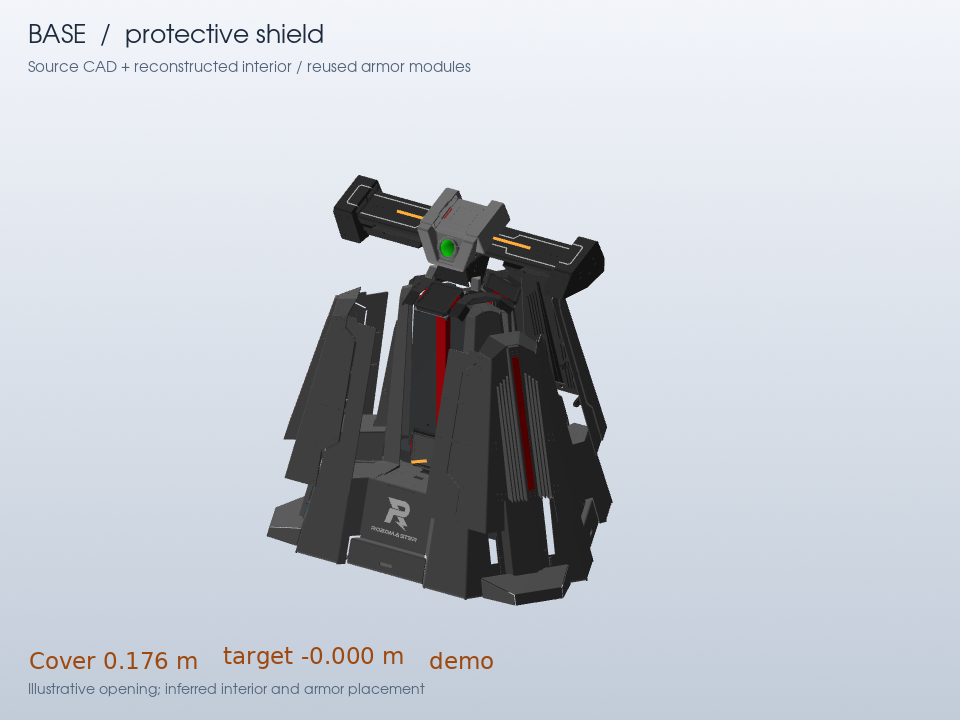

# Reconstructed base interior

The updated reconstruction follows the open Base in rulebook V2.1.0 Figure
4-12 and the user's screenshot. It replaces the incorrect full-height triangular
housing with a low mounting plinth, three lower armor modules, and a narrow central core. The original struts and upper armor assemblies remain.



The approximate triangular plinth is centered at `[-0.111, -0.00025]` m,
with heights 0.100-0.320 m and circumradii 0.300-0.270 m. Three reused modules
face the bays at 60, 180, and 300 degrees. Their LED centers are at 0.360 m,
placing the full modules at approximately 0.284-0.440 m. A closed triangular core wall spans 0.320-0.845 m, with circumradii
0.170-0.150 m. Three narrow red strips sit on its bay-facing walls at
0.400-0.830 m. This simple solid backing prevents seeing through the core. These dimensions
fit the pictured arrangement; they are not manufacturer drawings of the internals.

The donor is the original outpost's `rotor/armor_0`, pinned by SHA-256. Copies
retain its dimensions, triangles, materials, small armor classification, and
paired LED surface metadata. The red strips also carry team-color and LED
metadata, inferred from its appearance. All additions use the `reconstruction`
layer with explicit approximation evidence in both visual and collision assets.

Each shield now expands 170 mm outward and 45 mm down. The previous 230 mm
descent was unsupported and exposed the armor by dropping below it. The revised
shallow slide exposes the lower modules through the gaps between covers, as
shown in Figure 4-12. Exact linkage geometry and actuator stops remain unknown.
The schematic slide preserves upright cover orientation and keeps the covers
inside the original footprint.

`verify_reference_motion.py` checks the unchanged source triangle/material
multiset, fixed reconstruction transforms, footprint containment, and 25 frontal
visibility rays per lower module. No rays hit the fully opened covers; closed
covers obstruct the modules. This checks sampled frontal visibility, not complete
collision-free actuator mechanics.

[Clean orbit demo](previews/clean/base-joints-orbit.mp4) and
[inspection demo](previews/base-joints.mp4).

The source audit remains in [base-interior-audit.md](base-interior-audit.md).
Hide `reconstruction` to inspect the original hollow CAD:

```sh
ocpenv/bin/python python/preview/render_joints.py ../assets/rm2026-reference/equipment --asset base --hide-layer reconstruction --out out/base-source-only
```

Authored dimensions, donor hash, and bindings are in
[semantics-legacy-equipment.json](../rules/semantics-legacy-equipment.json).
