# Examples and demos / 示例与演示

[English README](../README.md) · [中文 README](../README.zh-CN.md) · [Architecture / 架构](architecture-overview.md)

Expand a section to see its GIFs. Each clip also has an MP4 link and a JSON report with input hashes and motion details. Use MP4 for the better-quality presentation. GIFs render inline in Markdown; MP4 playback depends on the viewer. These are recorded previews, not an interactive simulator.

展开各节即可查看 GIF，每段动画还提供 MP4 和记录输入哈希、运动信息的 JSON 报告。展示时优先使用 MP4。GIF 可直接嵌入 Markdown，MP4 是否内嵌播放取决于查看器。这些是录制预览，并非交互仿真器。

Clean clips use a black background and an orbiting camera without overlays. Fixed-camera inspections include labels and joint axes. Text and logos belonging to the CAD remain geometry. Demo-specific approximations are noted beside each mechanism.

纯净预览使用黑色背景和环绕镜头，不含叠加文字；固定视角检查包含说明与关节轴。CAD 本身的文字和标志仍保留为几何。每个机构旁均说明演示中的近似处理。

Base / 基地

Shields expand around a fixed reconstructed inner wall and three lower armor modules. The dart target travels along its rail. Shield travel is illustrative; the rail range is ±280 mm and its four-second sine timing is demo-only.

护甲围绕固定的补建内壁和三块下部装甲展开，飞镖靶沿轨道移动。护甲行程为示意值；轨道范围为 ±280 mm，四秒正弦周期仅用于演示。

### Clean orbit / 纯净环绕

[MP4](previews/clean/base-joints-orbit.mp4) · [GIF](previews/clean/base-joints-orbit.gif) · [Report / 报告](previews/clean/base-joints-orbit.json)

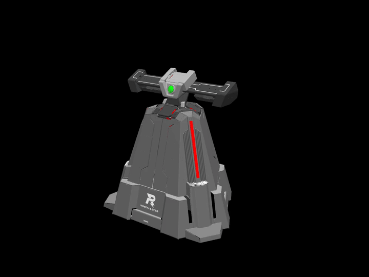

### Fixed-camera inspection / 固定视角检查

[MP4](previews/base-joints.mp4) · [GIF](previews/base-joints.gif) · [Report / 报告](previews/base-joints.json)

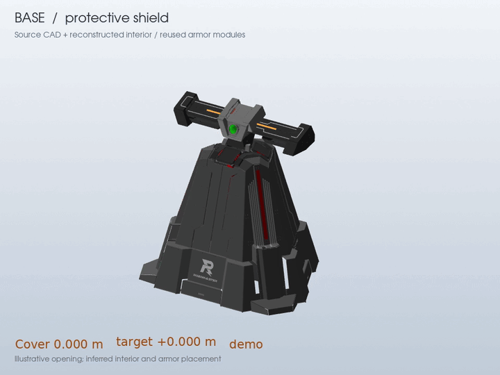

[Mechanism notes / 机构说明](base-reconstruction.md)

Technology Core / 科技核心

The 14-second pose tour lifts, turns, sweeps, aligns, translates 100 mm, retracts, and returns. Source tool-enclosure panels are restored. Joint bearings remain schematic and the rig is preview-only. The fixed-view clip below retains the simpler 100 mm translation.

14 秒姿态演示依次抬升、转向、横移、对准、平移 100 mm、回撤并归位。工具外壳已恢复源 CAD 面；轴承仍为示意模型，绑定仅用于预览。下方固定视角保留较简单的 100 mm 平移动画。

### Clean orbit / 纯净环绕

[MP4](previews/clean/tech-core-demo-orbit.mp4) · [GIF](previews/clean/tech-core-demo-orbit.gif) · [Report / 报告](previews/clean/tech-core-demo-orbit.json)

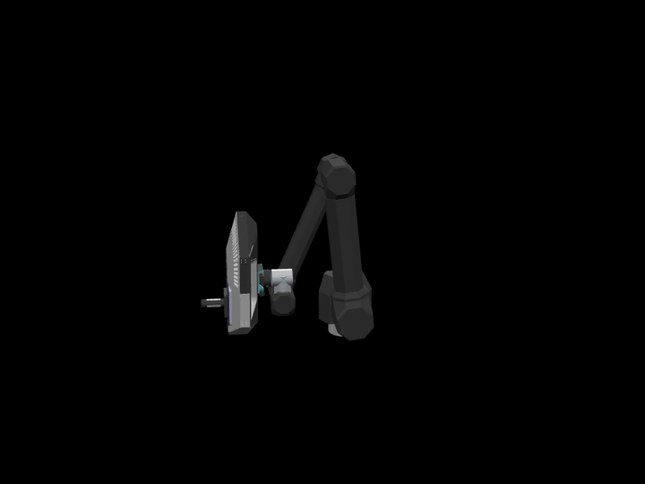

### Fixed-camera inspection / 固定视角检查

[MP4](previews/tech-core-demo.mp4) · [GIF](previews/tech-core-demo.gif) · [Report / 报告](previews/tech-core-demo.json)

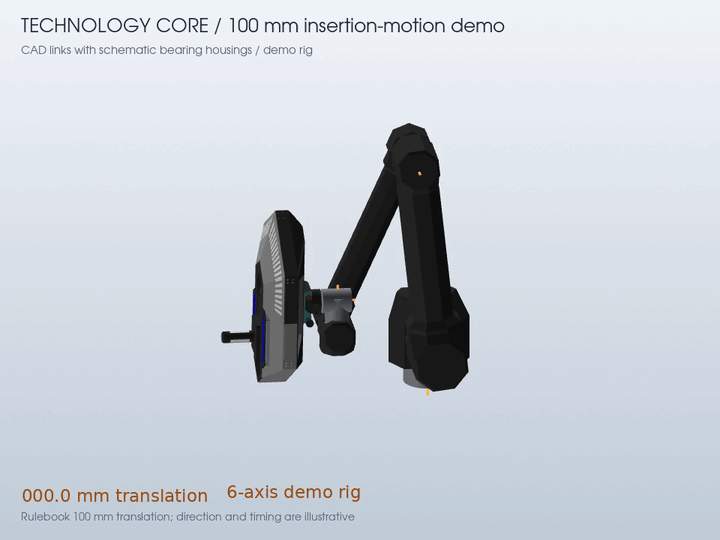

[Mechanism notes / 机构说明](technology-core-joints.md)

### Exported joint frames / 导出的关节框架

This earlier diagnostic moves only the six exported frames. The CAD meshes remain at rest; it is not the animated demo rig above.

这段检查只移动导出的六个关节框架，CAD 网格保持静止，与上面的网格动画绑定不同。

[MP4](previews/tech-core-joints.mp4) · [GIF](previews/tech-core-joints.gif) · [Report / 报告](previews/tech-core-joints.json)

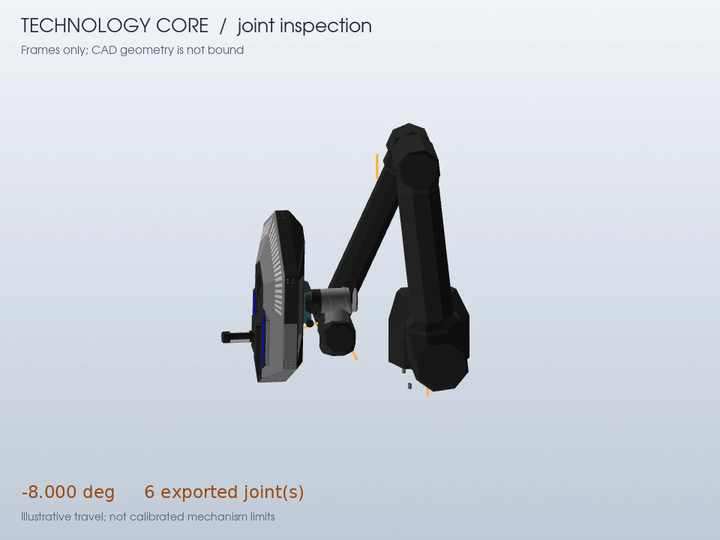

Power Rune / 能量机关

Arms and surrounding hubs rotate while the central R logos and shafts stay fixed. This is a 360-degree inspection sweep, not a calibrated match-speed profile.

叶臂与外围轮毂旋转，中心 R 标志和轴保持固定。该动画为 360 度检查，不代表校准后的比赛转速。

### Clean orbit / 纯净环绕

[MP4](previews/clean/rune-joints-orbit.mp4) · [GIF](previews/clean/rune-joints-orbit.gif) · [Report / 报告](previews/clean/rune-joints-orbit.json)

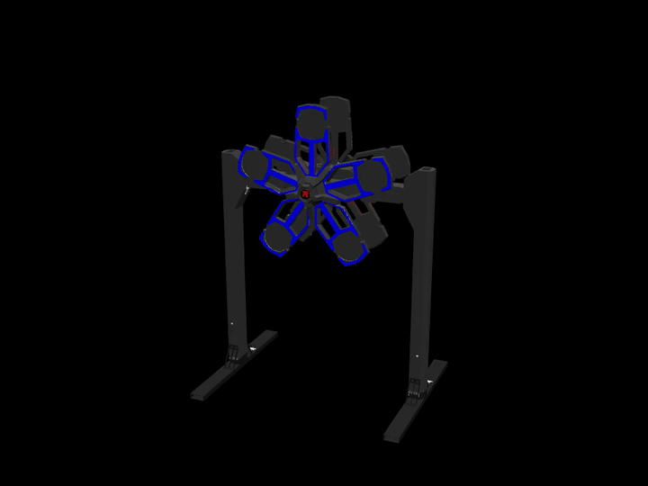

### Fixed-camera inspection / 固定视角检查

[MP4](previews/rune-joints.mp4) · [GIF](previews/rune-joints.gif) · [Report / 报告](previews/rune-joints.json)

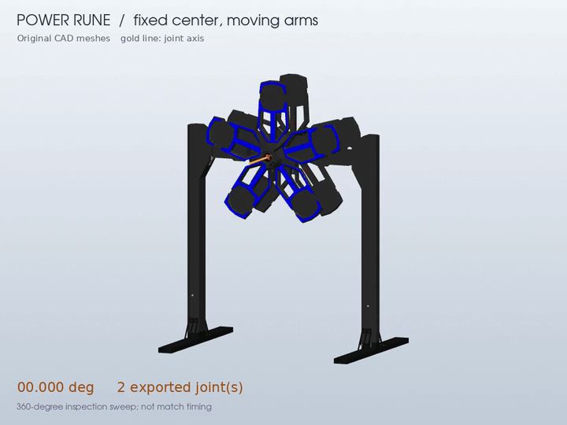

[Mechanism notes / 机构说明](reference-assets.md)

Outpost / 前哨站

The rotor and its attached fasteners move together. The orbit clip shows the complete assembly; the fixed camera makes the rotor motion easier to inspect. Timing is illustrative.

转子与附属紧固件一起运动。环绕镜头展示整体，固定镜头便于观察转子运动；时序为示意值。

### Clean orbit / 纯净环绕

[MP4](previews/clean/outpost-joints-orbit.mp4) · [GIF](previews/clean/outpost-joints-orbit.gif) · [Report / 报告](previews/clean/outpost-joints-orbit.json)

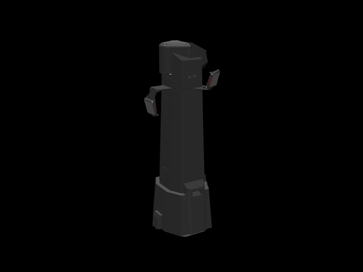

### Fixed-camera inspection / 固定视角检查

[MP4](previews/outpost-joints.mp4) · [GIF](previews/outpost-joints.gif) · [Report / 报告](previews/outpost-joints.json)

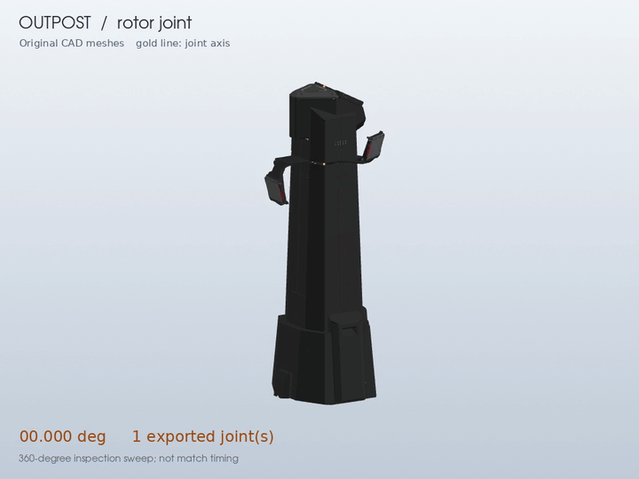

[Mechanism notes / 机构说明](reference-assets.md)

Dart station / 飞镖发射井

The window follows the 15-degree guides and closes at the inferred 205 mm platform level. Guides and the separate gliding platform stay fixed. Physical end stops and actuator timing remain uncalibrated.

窗口沿 15 度倾斜导轨滑动，关闭位置按图示推定在 205 mm 平台高度。导轨及独立滑移平台固定，实际限位和执行器时序尚未校准。

### Clean orbit / 纯净环绕

[MP4](previews/clean/dart-station-joints-orbit.mp4) · [GIF](previews/clean/dart-station-joints-orbit.gif) · [Report / 报告](previews/clean/dart-station-joints-orbit.json)

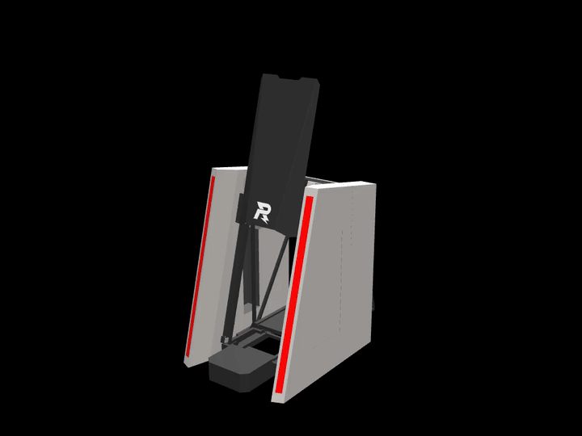

### Fixed-camera inspection / 固定视角检查

[MP4](previews/dart-station-joints.mp4) · [GIF](previews/dart-station-joints.gif) · [Report / 报告](previews/dart-station-joints.json)

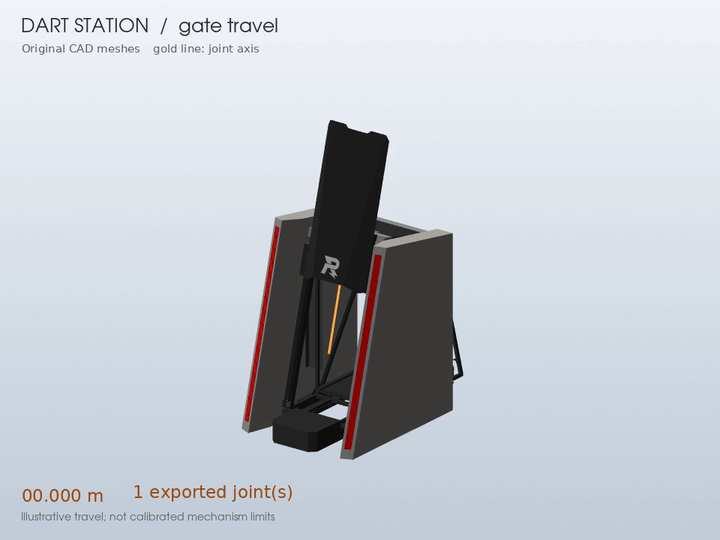

[Mechanism notes / 机构说明](dart-window.md)

Whole field and elements / 完整场地与元素

The field overview shows placement and coverage. The element sheet compares individual assets. These static images predate the latest mechanism reconstruction and are retained as field-layout examples.

场地总览用于检查位置与覆盖，元素图用于比较独立资源。这些静态图片早于最新机构补建，保留作为场地布局示例。

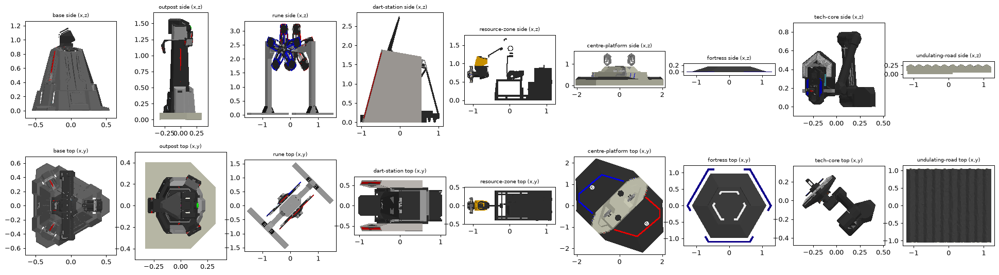

For regenerable orbitable HTML previews, see [the viewer pipeline / 查看器流程](previews.md).

Base interior and source audit / 基地内部与源模型审计

The first image shows the current solid inner wall and lower armor. The following images inspect the earlier source-only structure. The inferred reconstruction is explicitly separate from the original CAD.

首图展示当前实体内壁与下部装甲，后续图片检查原始源模型结构。推定补建与原始 CAD 明确区分。

[Reconstruction / 补建说明](base-reconstruction.md) · [Source audit / 源审计](base-interior-audit.md) · [Version comparison / 版本对照](previews/base-version-comparison.json)

Core enclosure audit / 科技核心外壳审计

Complete static source on the left, corrected demo rig on the right. The demo now restores 26,513 enclosure and fitting triangles previously hidden with shared hardware. Some joint bearings still use schematic replacements.

左侧为完整静态源模型，右侧为修正后的演示绑定。此前随共享硬件一起隐藏的 26,513 个外壳和附件三角形已恢复，部分关节轴承仍使用示意替代件。

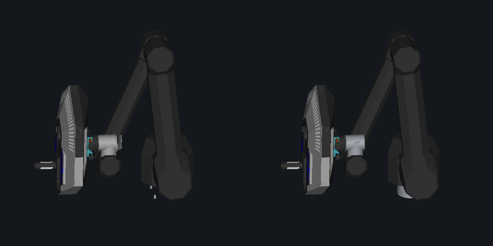

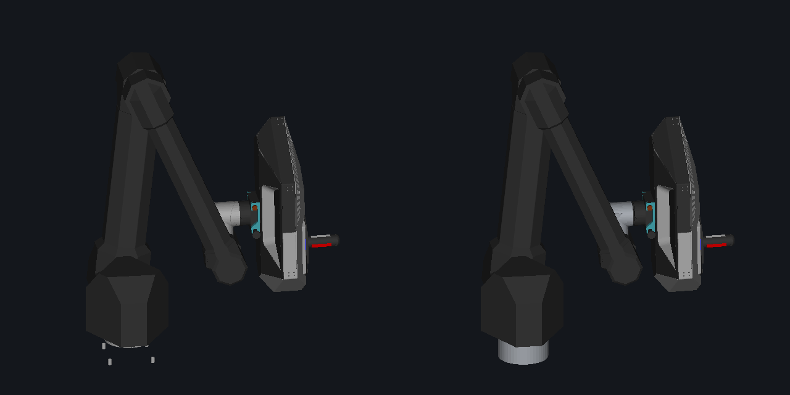

[Audit / 审计](previews/core-audit/audit.json) · [STEP face validation / STEP 面数校验](previews/core-audit/step-validation.json) · [Rig details / 绑定说明](technology-core-joints.md)

## Reproduce / 重新生成

Follow [Getting started / 使用指南](getting-started.md) for dependencies and source packages. The [clean-preview instructions / 纯净预览说明](previews/clean/README.md) give the rendering commands. [Motion verification / 运动验证](previews/motion-verification.json) records the current geometry and joint checks. Updating source files requires regenerating the clips; each JSON report identifies the inputs used for that recording.

依赖和源资源准备见[使用指南](getting-started.md)，渲染命令见[纯净预览说明](previews/clean/README.md)。[运动验证](previews/motion-verification.json)记录当前几何与关节检查。源资源更新后需要重新生成动画，每份 JSON 报告均标明该次录制的输入。
