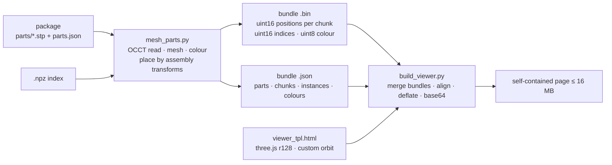

# Previews

Two kinds of page exist, both built from the split part files, never from
the whole STEP:

| Page | Shows | Built from |
|---|---|---|
| RMUC 2026 Field in 3D (V2.0.0) | Orbitable mesh of the whole field; arena tinted by height (the file has only cream), equipment in its 30 exported colours | `prototype/preview/v20.json` |
| RMUC 2026 V1.2.0 Field Colours | Same pipeline on V1.2.0, opening in the exported per-face colours (white, beige, red, navy, dark grey) | `prototype/preview/v12.json` |
| RMUC field package (plan view) | Footprints of every part with per-part statistics from `parts.json` | `parts.json` only, no meshing |

The pages are Claude artifacts (private links in the session that made
them); the HTML files they were built from are regenerable with the steps
below.

## Pipeline



### 1. Environment

OCCT 8.0.1 through `cadquery-ocp` in a uv venv (works on this Mac; the
system `python3` has no numpy):

```sh
uv venv ocpenv --python 3.12 && ocpenv/bin/pip install cadquery-ocp numpy
```

OCP 8 renamed a few things the scripts rely on:
`OCP.collections.Sequence_TDF_Label`, `XCAFDoc_ShapeTool.GetShape_s`,
`BRep_Tool.Triangulation_s`, `TopExp.MapShapes_s`,
`BRepMesh_IncrementalMesh(shape, lin, False, ang, True)`.

### 2. Mesh bundle

```sh
P=~/dev/RM/rm-map-tools/prototype
ocpenv/bin/python $P/mesh_parts.py rs_v20 v20.npz mesh_v20.bin mesh_v20.json --lin 4 --ang 0.5
```

| Flag | Meaning |
|---|---|
| `--lin`, `--ang` | linear (mm) and angular (rad) deflection for arena-sized parts; parts above 20 MB get `lin × (1 + 2·log10(bytes/20 MB))` and a proportionally looser angle, capped at 1 rad |
| `--min-face MM` | skip faces whose triangulation bbox diagonal is below `MM` (screws, chamfers, holes); the main size lever for equipment |
| `--only a,b` | mesh only these product names (a name shared by several products matches all of them) |
| `--arena-only` | only `BREP_` products |

Per part the script reads the STEP with XCAF, meshes the compound, and for
every face takes the triangulation transformed by its location, flips
reversed faces, and resolves the colour face > shell > solid > root. Each
part is stored as chunks of at most 65,535 vertices with quantised
positions (origin + scale per chunk) and one colour index per triangle.
Instances are the world matrices from
`occurrence_transforms` (see `step-notes.md` §3), stored column-major in mm.

Budget: the page embeds the bundle deflated and base64-encoded, so about
10 MB of raw bundle is the ceiling. Arena parts are cheap (V2.0.0 arena
1.1 MB at 4 mm, V1.2.0 arena 0.4 MB); equipment is the cost. What was used:

| Run | Settings | Result |
|---|---|---|
| V2.0.0 all parts | `--lin 4 --ang 0.5` | 1.55 M triangles, 21.3 MB, 252 s |
| V2.0.0 six heavy equipment products | `--lin 8 --ang 0.7 --min-face 12 --only 26062900,0003,0006,000,00000_0001` | 0.57 M triangles, 7.6 MB, 234 s |
| merged page | | 683 k triangles, 9.0 MB raw, 5.1 MB deflated, 7.0 MB page |
| V1.2.0 all parts | `--lin 4 --ang 0.5 --min-face 6` | 2.05 M triangles, 27.0 MB, 145 s |
| V1.2.0 coarse | `--lin 10 --ang 0.8 --min-face 15` | 0.81 M triangles, 10.6 MB, 137 s |
| merged page | arena from the fine run, equipment from the coarse run | 813 k triangles, 10.7 MB raw, 6.2 MB deflated, 8.6 MB page |

### 3. Page

```sh
ocpenv/bin/python $P/preview/build_viewer.py $P/preview/v20.json mesh_v20 mesh_eq
ocpenv/bin/python $P/preview/build_viewer.py $P/preview/v12.json mesh_v12c mesh_v12:arena
```

Bundles are given as paths without extension; later bundles override
earlier ones per product id, and a `:arena` suffix keeps only the `BREP_`
parts of that bundle. The builder pads every chunk to 2-byte alignment
(typed arrays reject odd offsets), finds the floor slab as the arena part
with the largest footprint and records its top z, fills the placeholders in
`viewer_tpl.html` from the config (`__TITLE__`, `__EYEBROW__`, `__SUB__`,
`__ABOUT__`, default tint) and writes `cfg["out"]` next to the config.

The page loads three.js r128 from cdnjs (the only script host the artifact
sandbox allows), decompresses the bundle with `DecompressionStream`, and
builds one `BufferGeometry` per chunk with per-vertex colours (OCCT
triangulations do not share vertices across faces, so per-vertex equals
per-face). Controls: drag to orbit, wheel or pinch to zoom, right-drag or
shift-drag to pan, arrow keys, click to pick a part (name, product id,
triangles, instances, chunk size, hit point above the floor). Buttons jump
to isometric, top and the two base ends; toggles hide equipment and switch
the arena between height tint and exported colour. Light and dark themes
follow the viewer.

### 4. Plan view

The plan-view page draws each part's bounding box from `parts.json`, with
the V2.0.0 arena in identity placement and heights measured from the floor
slab top. It was produced in-session from `parts.json` with an inline
script; regenerating it means re-deriving that data (per-part bbox, body
count, faces, colours) from the manifest, which `parts.json` fully
contains.

## Limits

- Preview tolerance, not the 1 mm validation mesh; curved parts look
  faceted on purpose and small equipment faces are dropped.
- One V2.0.0 part fails to read in OCCT in every run and is absent; it is
  the same part flagged in `out/v20/validation.json`.
- Browsers without `DecompressionStream` (anything older than 2023) show a
  decode error instead of the model.
