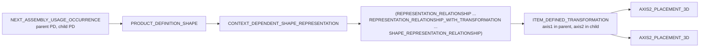
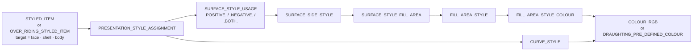

# STEP notes: what the DJI files actually contain

Reference for anyone touching `model.rs`, `split.rs` or the package rules.
Everything here was measured on the files, cross-checked with OCCT XCAF,
and for V2.0.0 against the 9 h whole-file glb. Dates: 2026-09-10.

## 1. The files and their exporters

| File | Exporter | Schema | Shape |
|---|---|---|---|
| `UTF-8__RMUC2026_V2.0.0.stp`, 1.25 GB, CRLF | Creo Parametric 2019164 | `CONFIG_CONTROL_DESIGN` + `SHAPE_APPEARANCE_LAYERS_GROUPS` (AP203 with the AP214 presentation entities) | flat: root `00_RMUC2026_FINALS_ASM` with 26 children; `DOCUMENT_A_ASM` holds 420 anonymous arena bodies `BREP_N`; equipment products are huge single files (`26062900` 674 MB, 67 bodies) |
| `UTF-8__RMUC2026_V1.2.0.step`, 993 MB, LF | ST-Developer v20.1 for the Autodesk Translation Framework, converted from IGES (`rmuc2026__0001_asm_1230_igs`) | `AUTOMOTIVE_DESIGN` (AP214) | real tree, 1,047 products, 1,071 occurrences, 253 non-identity placements, 79,247 bodies of which 78,028 are single-face sheet bodies |
| `UTF-8__RMUL2026.stp`, 1.7 MB | Creo, same author | as V2.0.0 | one `BREP_WITH_VOIDS` league arena with coloured floor and markings |
| `UTF-8__能量单元.stp`, 842 KB | Creo | as V2.0.0 | rune unit |

Entity ids are not contiguous and, in V2.0.0, not in file order (`#324` is
the first instance, PDM entities come last).

## 2. Ownership: which product owns a body

```mermaid
flowchart LR
    PRODUCT --> PDF[PRODUCT_DEFINITION_FORMATION<br/>_WITH_SPECIFIED_SOURCE]
    PDF --> PD[PRODUCT_DEFINITION]
    PD --> PDS[PRODUCT_DEFINITION_SHAPE]
    PDS --> SDR[SHAPE_DEFINITION_REPRESENTATION]
    SDR --> REP[ADVANCED_BREP_SHAPE_REPRESENTATION<br/>or MANIFOLD_SURFACE_SHAPE_REPRESENTATION<br/>or SHAPE_REPRESENTATION or complex]
    REP --> BODY[MANIFOLD_SOLID_BREP · BREP_WITH_VOIDS<br/>SHELL_BASED_SURFACE_MODEL · FACETED_BREP]
    REP2[second representation] -->|SHAPE_REPRESENTATION_RELATIONSHIP| REP
    BODY --> SHELL[CLOSED_SHELL / OPEN_SHELL] --> FACE[ADVANCED_FACE] --> BOUND[FACE_OUTER_BOUND / FACE_BOUND] --> LOOP[EDGE_LOOP] --> EDGE[ORIENTED_EDGE → EDGE_CURVE] --> V[VERTEX_POINT → CARTESIAN_POINT]
```

Arrows point the way the file's references point (a `PRODUCT_DEFINITION`
references its formation, and so on down); the model inverts them.
`SHAPE_REPRESENTATION_RELATIONSHIP` attaches extra representations (sheet
bodies in V1.2.0) to the same product. When traversing an `ADVANCED_FACE`,
drop only its last reference (the surface); the bounds are all the others.
Bounding boxes come from the vertex points, transformed into the part's own
frame only, so V1.2.0 boxes must be mapped through the occurrence transforms
before they are compared to V2.0.0.

## 3. Assembly transforms

For an occurrence, `world = P(axis2) · P(axis1)⁻¹` where `P` builds the 4×4
from origin, axis (Z) and ref direction (X). V2.0.0: all 421 arena
occurrences are identity and the equipment roots have two occurrences each
with real transforms. V1.2.0: 253 non-identity placements, many of them a Z
flip. `python/mesh_parts.py::occurrence_transforms` is the reference
implementation; the extent it produces matches the plan-view bounds
(X ±14.9 m, Y −6.4…9.6 m).

## 4. Colours

### The only mechanism present

Styles reference the geometry, never the reverse, which is why the split
needs reverse tables. Precedence, the same in OCCT and in our model:
**face > shell > body**. A two-sided face style (`.POSITIVE.` and
`.NEGATIVE.` usages, V2.0.0) shows the positive side. In
`OVER_RIDING_STYLED_ITEM` the target is the second-to-last reference.
Colour keys are canonicalised to `r,g,b` with four decimals; names given
in the file (`Opaque(255,7,7)`, `'red'`) are kept alongside.

Neither file uses any other route. Checked and absent: styled
`MAPPED_ITEM`, `CONTEXT_DEPENDENT_OVER_RIDING_STYLED_ITEM`, styled
`SHAPE_REPRESENTATION` (the per-instance colour mechanisms), `INVISIBILITY`,
`DRAUGHTING_MODEL`, `CAMERA_MODEL`, colour-carrying layers. OCCT's reader
supports all of those, so if they appear in a future release the model
needs the corresponding lookup.

### What each file carries

**V1.2.0** styles every arena solid grey (`Opaque(160,160,160)`) at body
level and every one of its faces individually on top: white for most of
the surface, beige `(200,200,180)` plate sides, dark grey `(65,65,65)`
plate tops, red `(255,7,7)` and navy `(17,1,151)` marking sheets. So the
body colour alone makes the arena look uniformly grey; the face histogram
is the truth. Equipment is the opposite: body-level colour only. All 55
`COLOUR_RGB` entities are referenced. No layers, overrides, mapped items or
curve styles anywhere.

**V2.0.0** styles every arena face, body and edge curve with one shared
cream entity, `#320=COLOUR_RGB('',1.,1.,0.949)`. That is all the arena
colour in the file, confirmed by OCCT on every part and by the whole-file
glb (all 424 arena nodes one material). Of its 756 `COLOUR_RGB` entities
725 are never referenced; 419 of them are the same blue-grey
`(0.438,0.503,0.6)` written right after each arena body's placement, which
looks like Creo emitting the body's own appearance and then styling with the
appearance in effect at export. Creo supports per-part and per-instance
colours in this export mode, so the cream is what the assembly looked like
when it was exported, not a limitation of the format. Equipment keeps 30
real colours through face styles and 795 `OVER_RIDING_STYLED_ITEM`s.

Consequence for the package: arena colour for V2.0.0 geometry has to be
transplanted from V1.2.0 by fingerprint matching, or assigned from
`rules/palette.toml`. It cannot be recovered from V2.0.0 itself.

### Layers

V2.0.0's 3,848 `PRESENTATION_LAYER_ASSIGNMENT`s are the Creo component
names (`0003_1_2`, `HOU_HANBAN_1`, `_26062200_2`, …), nested per instance,
and reference faces and bodies of equipment only; no arena body is on a
layer. They hold 88 M references, 91 % of all references in the file, so
they must be handled as filtered lists. V1.2.0 has none.

## 5. Scanner requirements (all hit in practice)

- Instances wrap across lines; `#id=` starts a line and `;` may end it many
  lines later. The terminator is the first `;` outside a string and outside a
  `/* */` comment.
- `#id=` is contiguous; a space before `=` does not occur and is not
  accepted.
- Complex instances `#id=(A(...)B(...));` have no single type name.
- Strings use `''` for a quote and may contain `;`, `(`, `#`, `\X2\…\X0\`
  (UTF-16BE, Chinese product names) and `\X\HH`; never regex `#\d+` inside
  them.
- Comments appear in the V1.2.0 header.
- Numbers are written like `9.49E-1`; search by value, not by decimal text.

## 6. Other properties worth knowing

- V1.2.0 carries per-product material properties
  (`PROPERTY_DEFINITION` → `PROPERTY_DEFINITION_REPRESENTATION` →
  `REPRESENTATION('material name', …)`, density 7850 etc.).
- `7000001_1_ASM` (V1.2.0) carries 38,001 single-face sheet bodies
  directly; `0013_1_ASM` 17,135; `001_1_ASM` 11,685. Duplicated
  sub-assemblies are true instances of one product.
- OCCT builds a `BREP_WITH_VOIDS` whose void shells are not enclosed as a
  compound of solids and puts the body colour on the compound; it also
  drops `OPEN_SHELL` colours in `26062900` and heals three faces by
  splitting them. These are the only OCCT-side differences from the text
  scan.
- The V2.0.0 floor slab is `BREP_9`, top at z = −1530.4 mm; V1.2.0's is
  `BREP_1128_0001_1`, top at z = −1641.3 mm (29.05 × 16.05 × 0.2 m). Arena
  extent X ±14.9 m, Y −6.4…9.6 m in both.
