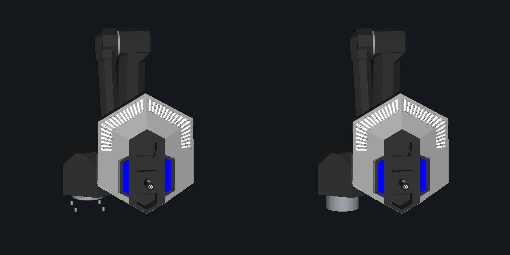

# Technology Core joints

The reference exports six identified revolute axes as a serial chain in both
glTF nodes and `articulation.json`. These are **joint frames only**. The CAD
meshes remain at their source pose until their rigid membership is verified.
Moving the frames does not animate the arm meshes or their collision.

## Contents

- [Interactive end-effector dragging](#interactive-end-effector-dragging)
- [Rule-based translation demo](#rule-based-translation-demo)
- [Pose tour](#pose-tour)
- [Missing enclosure faces in the demo](#missing-enclosure-faces-in-the-demo)

| Joint ID suffix | Source bearing evidence |
| --- | --- |
| `base_yaw` | Coaxial vertical base bearing cylinders in `0006_1_ASM` |
| `shoulder_pitch` | 76 mm radius cylinder in `0006_1_24` |
| `elbow_pitch` | 59 mm radius cylinder in `0006_1_24` |
| `wrist_1` | Coaxial 30.5–43.5 mm radius cylinders in `0006_1_29` |
| `wrist_2` | Coaxial 27–41 mm radius cylinders in `0006_1_ASM` |
| `tool_roll` | Coaxial 27–39.2 mm radius cylinders in `0006_1_ASM` |

Full IDs begin with `tech-core.arm.`. The exact origins and unit axes are in
[`semantics-legacy-equipment.json`](../rules/semantics-legacy-equipment.json).
They come from `BRepAdaptor_Surface.Cylinder()` on the source STEP shapes,
transformed through the source occurrence matrix into the equipment GLB's
local metre frame. An origin can be anywhere along its cylinder axis; its
axial coordinate does not change the revolute motion.

The chain is:

```text
tech-core
  base_yaw -> link.1
    shoulder_pitch -> link.2
      elbow_pitch -> link.3
        wrist_1 -> link.4
          wrist_2 -> link.5
            tool_roll -> link.6
```

The frame axes retain the source rest orientation. In particular, the wrist
axes are not rounded to the world cardinal directions. The chain is not a DH
parameter table, controller zero calibration or manufacturer joint convention.

The source GLB's 14 flat mesh nodes now have readable names for the upper arm,
forearm, shoulder housing, seals, tool pieces and shared joint hardware. Their
metadata says `rigid_binding_status: unverified`. The shared hardware mesh
contains multiple bearings, wrist parts and tool details; attaching that whole
mesh to one link would move unrelated mechanisms together. Named parts alone
are insufficient to justify an articulated collision model.

Every exported joint says `geometry_binding: frames_only` and
`limits_status: unknown`. No mechanical stops, velocities or unlimited rotation
are claimed. The ±8-degree `preview_range` controls only the diagnostic frame
sweep. `apply_pose` does not enforce that range as a physical limit.

Rulebook V2.1.0 section 5.3.3 describes end-effector pose coordinates. Those
coordinates are not the arm's individual mechanical joint limits. The tool's
P/Q mechanism in Figure 5-7 is separate and remains pending its own source
binding.

The next step for mesh animation is an explicit triangle/body partition of the
shared hardware, checked at each bearing interface. All 216,438 original
visual and collision triangles are preserved at rest. The integration verifier
also checks that moving this frame-only chain leaves unbound mesh transforms
unchanged.

Inspect the fixed exported frames in the [interactive viewer](viewer.md).

## Interactive end-effector dragging

The [site viewer](viewer.md#drag-the-technology-core-tool) supports position dragging on the separate CAD display rig. A translation handle and a bounded cyclic-coordinate-descent solver use the existing six joint bindings. They use the display rig's ±1.2 rad preview ranges, about ±68.8°, and report residual position error. Orientation is free, and the handle represents the tool assembly's bounding-box center rather than a calibrated insertion point.

This small viewer feature needs no new CAD partition or exported articulation contract. Full pose dragging with held orientation, physical joint limits, and collision avoidance would need additional work. The [range-update validation](../benchmarks/2026-09-11-core-preview-range/README.md) covers the wider exported display ranges. The Python trajectory examples below retain their separate orientation-constrained solver.

## Rule-based translation demo

This separate demo illustrates the Level 2 requirement in rulebook section
5.3.3 for 100 mm of translation after insertion. Inverse kinematics drives
all six identified axes while holding the tool at its CAD rest orientation.
The example translates toward the arm and returns in a six-second loop.
The helper supplies direction, timing, and return motion; no insertion event,
match state or absolute rulebook pose frame is simulated.

The disposable preview rig uses the existing CAD link and tool meshes. It
partitions 26,513 tool-enclosure and fitting triangles out of the shared hardware
mesh and attaches them to the tool link. The remaining 91,775 mixed hardware
triangles are hidden and six schematic bearing housings stand in for the joints. Bearing radii follow the
identified source cylinders; their lengths and ownership are approximate.
This rig is never written back into the
reference GLB and does not add articulated collision to the simulator.

[`tech_core_demo.py`](../python/preview/tech_core_demo.py) stores the rig and
trajectory implementation. The solver and exported display catalog share ±1.2 rad angular bounds. These are numerical guards,
not mechanical stops. Tests compare its forward kinematics with the exported
serial-frame transforms. The integration verifier also applies the solution
to the actual preview scene and checks a 0.100 m tool displacement with
unchanged orientation. Error measurements are retained in the motion verification report.

Q-axis tool rotation, the separate P/Q tool bindings, and the other difficulty
levels are not included in this translation demo.

## Pose tour

The retained rig helper includes a fourteen-second pose tour.
Seven smooth segments lift the tool, turn left, sweep right, align, translate
100 mm at fixed orientation, retract, and return to the source pose. The path
includes up to 160 mm of lift and 200 mm of lateral sweep. Rotation varies
during the positioning stages. All six joints are solved against the requested
tool poses.

The pose tour follows an authored path around the CAD rest pose. Only the
100 mm translation segment comes directly from the Level 2 insertion requirement.
It does not claim calibrated world coordinates, collision-free operation, or
hardware limits. The helper also retains the earlier translation trajectory.

## Missing enclosure faces in the demo

The missing white enclosure panels were a preview-rig error. The previous demo
hid all 118,288 triangles of `shared_joint_hardware`, including tool panels.
Those panels were present in the complete static reference. The demo now restores
the contiguous triangle range `[91775, 118288)` under link 6. A mesh fingerprint
pins that partition; it is not selected by a runtime bounding-box heuristic.
The range comprises 106 welded components on the tool side of the wrist. The
remaining mixed bearing hardware still uses the documented schematic substitutes.



The audit found no missing faces in the checked STEP import: all 14 selected
products passed face-count, vertex-bounds and face-color comparisons, totaling
7,227 imported faces. This includes the mixed `0006_1_ASM` product, which contains
hardware for both Core instances and the island's letter details. It does not
mean the real hardware is fully described by the CAD. All 216,438 triangles in
the exported single-Core source match the static reference at rest. Audit renders
disable backface culling, so the observed demo holes were not one-sided rendering.

[Audit measurements](previews/core-audit/audit.json) and
[STEP validation](previews/core-audit/step-validation.json).

The static comparison images are retained as audit evidence.

For the STEP check, split `0006_1_ASM` and `0006_1_24` through `0006_1_36`
from `v12.npz` with `python/p21split.py --products` and run
`python/validate_parts.py <split-directory> --mesh`. Use a temporary directory.
The integration verifier checks the restored enclosure triangles against their
source and confirms that they retain their transform relative to the moving tool.
