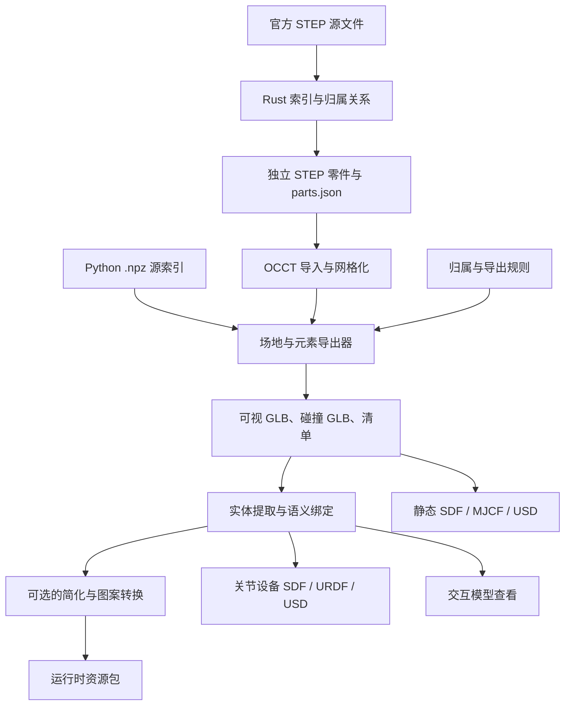

# 架构

[文档](index.md) · [导出](exporting.md) · [简化](simplification.md) · [English](../architecture.md)

`rm-map-tools` 将源拆分、CAD 网格化和资源包处理分开。Rust 负责 STEP 字节与引用；Python 通过 OCCT 导入拆分零件，生成查看器和仿真器使用的资源。

## 目录

- [处理流水线](#处理流水线)
- [源处理](#源处理)
- [资源生成](#资源生成)
- [运动与消费方](#运动与消费方)
- [代码结构](#代码结构)

## 处理流水线

各分支是独立的工作流，一种格式适配器不会自动执行全部优化步骤。输入见[导出](exporting.md)，顺序约束见[简化](simplification.md)。

## 源处理

Rust 扫描器记录每个 STEP 实体的 ID、类型、字节区间和对外引用。归属模型识别产品、实体、装配出现关系和样式。拆分器沿每个产品的引用复制选中的几何实体，并把共享的呈现列表过滤为选中成员。

该阶段无需 CAD 内核。OCCT 导入拆分后的零件以检查面数、包围盒和颜色，并用三角形近似曲面。源数据保留与网格精度是分别校验的。[拆分证明](../split-proof.md)记录保留性证据；[STEP 实现参考](../step-internals.md)说明索引格式、Rust 模块与闭合算法。

Rust 的 `.p21idx` sidecar 与 Python 的 `.npz` 源索引是两种格式：CLI 使用前者；Python 几何导出器使用后者，配合 `parts.json` 与拆分出的 STEP 文件。

## 资源生成

场地与元素导出器应用位置和归属规则，分别网格化可视与碰撞几何，写出带清单和校验报告的 GLB。导出策略控制容差与显式碰撞排除。复制的设备保留其原有几何和元数据。

实体提取生成独立命名的资源。语义绑定把关节层级、装甲、LED、队伍颜色和图层元数据写入 GLB 节点 extras 和 `articulation.json`。规则可以按源三角形选择，因此绑定必须先于简化；纹理贴片在底图简化之后附加。

清单记录文件哈希和碰撞方式，消费方据此选择并校验碰撞体文件。哈希检查能发现文件变动，但不能证明几何精度。契约见[导出预设](../export-presets.md)、[语义导出](../semantic-export.md)和[网格简化](../mesh-simplification.md)。

## 运动与消费方

语义参考资源包与实际的仿真器安装相互独立。关节导出器使用其既有的运动节点层级创建刚体连杆和关节；含关节的静态适配输入在显式请求时按静止姿态烘焙。

文档查看器用 Three.js 渲染本地模型，并把关节坐标暴露为滑块。科技核心在参考资源中保留六个关节框架；其动画网格使用独立的预览绑定。比赛控制器属于消费方仿真器。见[参考资源](../reference-assets.md)与[关节设备格式](articulated-formats.md)。

## 代码结构

| 位置 | 职责 |
| --- | --- |
| `crates/step21/` | 扫描器、索引、归属模型与 STEP 拆分器 |
| `crates/rm-map-tools/` | `index`、`inspect`、`split` CLI |
| `python/export_*.py` | 几何、语义与仿真器导出器 |
| `python/export_job.py` | JSON 任务校验与按序阶段执行 |
| `python/simplify_package.py` | 网格缩减与偏差检查 |
| `python/texture_atlas.py` | 图案提取、底图简化与纹理导出 |
| `python/preview/` | 源 HTML 查看器与可复用的运动/绑定辅助 |
| `docs/.vitepress/` | 文档主题与交互模型查看器 |
| `rules/` | 导出设置与已复核的源选择 |
| `source/` | 下载辅助脚本与源/参考记录 |
| `benchmarks/` | 按日期归档的测量与复现脚本 |

耗时与内存测量见[性能记录](performance.md)。源遗漏与修正见[几何审计](../geometry-audit.md)。
